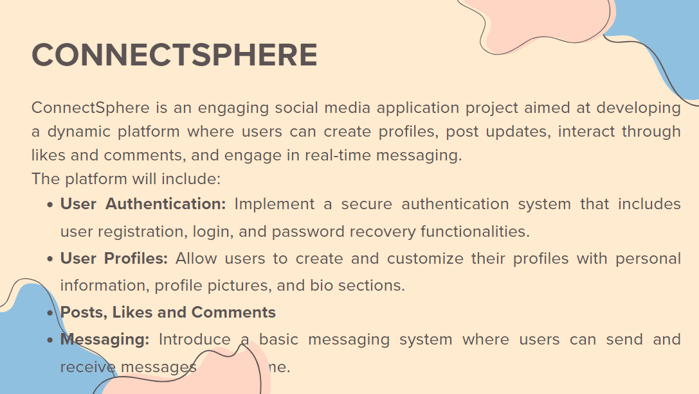
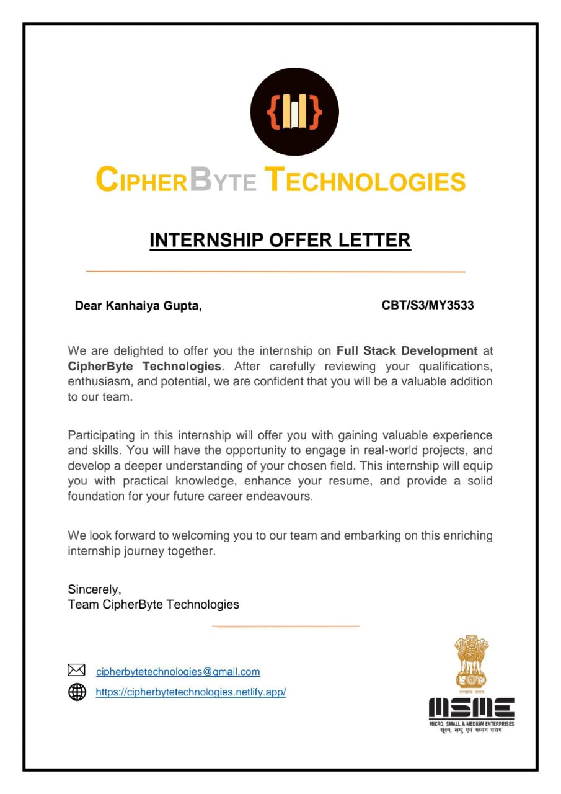
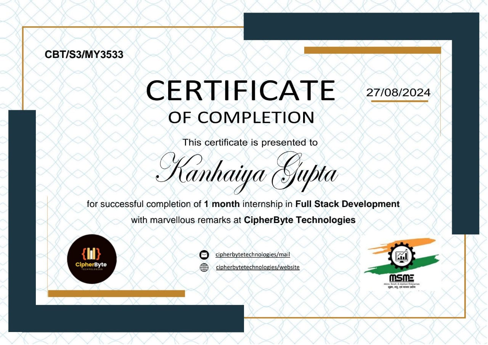
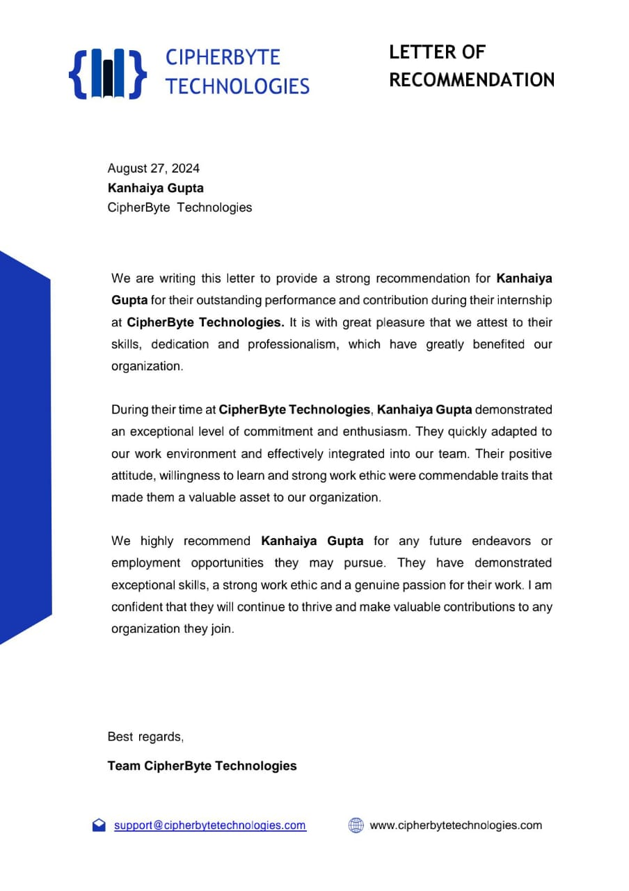

# 🎓 Internship Project at CipherByte Technologies

## 🚀 Overview

I am delighted to share that I have successfully completed my internship at **CipherByte Technologies 🏢**. This internship was an incredible journey filled with hands-on learning, full-stack development exposure, and professional growth.

Over the duration of the internship, I worked on building a **MERN Stack Application** named `CONNECTSPHERE` from scratch that includes user authentication, post creation, commenting, and dashboard functionalities. This README provides a comprehensive look at the project, along with the official credentials I received.

---

## 🛠️ Technologies Used

- **Frontend:** React.js, React Router, Bootstrap, CSS
- **Backend:** Node.js, Express.js
- **Database:** MongoDB (Mongoose ODM)
- **Authentication:** JWT-based login/logout
- **Other Tools:** Git, VS Code, Postman

---

## 📂 Folder Structure

```plaintext
CBT-CIP
|
├── backend
│   ├── controllers
│   ├── middlewares
│   ├── models
│   ├── routes
│   ├── .env
│   ├── index.js
│   └── package.json
│
├── frontend
│   ├── public
│   ├── src
│   │   ├── pages
│   │   ├── utils
│   │   ├── App.js
│   │   ├── index.js
│   │   └── index.css
│   └── package.json
│
├── utilities
│   ├── Certificate.jpg
│   ├── OfferLetter.jpg
│   ├── RecommendationLetter.jpg
│   └── Task.png
│
├── .gitignore
└── README.md

```
---

## 📦 System Requirements

    1. Node.js (v16+)
    2. MongoDB (local or cloud)
    3. React (v18+)
    4. npm / yarn


---

## ✨ Features Implemented
✅ User Registration with input validation

✅ JWT-based Authentication (Login / Logout)

✅ Create, Read, Delete Posts (with image upload)

✅ Commenting system per post

✅ Dynamic routing using React Router

✅ Error and success toast notifications

✅ Protected routes (based on auth)

✅ Clean and responsive UI using Bootstrap

---


## 🎖️ Internship Credentials
| 📌 Description         | 🌐 Image                                                |
| ---------------------- | ------------------------------------------------------- |
| Given Task During Internship |                     |
| Offer Letter           |              |
| Completion Certificate |              |
| Recommendation Letter  |  |


---

## 🔧 Setup Instructions
  
  1. Clone the repository:
``` bash  
git clone https://github.com/your-username/internship-mern-app.git
cd internship-mern-app
```

  2. Navigate to backend/ and install dependencies:
```bash
cd backend
npm install
```

  3. Create a .env file inside backend/:
``` bash
PORT=8080
MONGO_CONN=mongodb://localhost:27017/app-auth-db
JWT_SECRET=your_jwt_secret
```

  4. Start backend server:
```bash
node index.js
```

  5. Open a new terminal and setup frontend:
```bash
cd ../frontend
npm install
npm start
```


## 🙏 Acknowledgments

I am deeply grateful to the entire team at CipherByte Technologies for their support, mentorship, and valuable feedback throughout this internship journey.

This experience has not only enhanced my technical skills but also taught me how to work in a collaborative development environment. I'm excited to apply these learnings to future projects and opportunities. 🚀

📬 Connect with Me

LinkedIn: https://www.linkedin.com/in/kanhaiya-gupta-401303240

Email: kanhaiyaguptaksg@gmail.com

GitHub: https://github.com/codekanhaiya

🌐 [Visit Portfolio](http://officialkanha.epizy.com/) 

“Learning never exhausts the mind.” – Leonardo da Vinci


---


